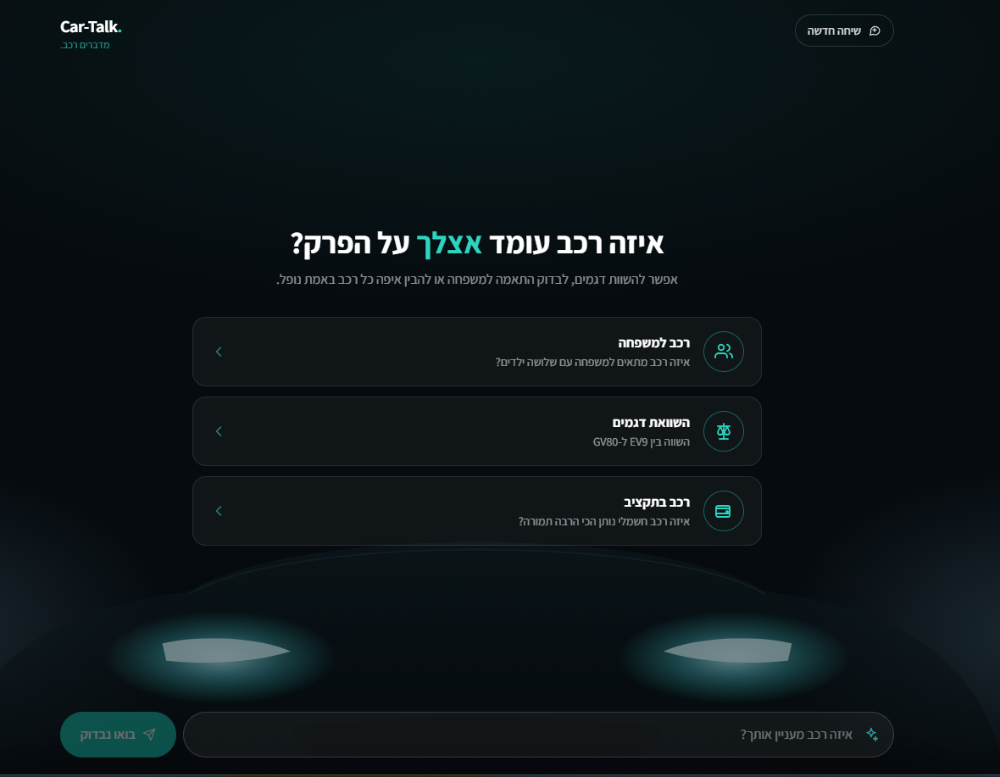

# Car-Talk 🚗

It helps users understand, compare, and choose cars, answering exclusively from real automotive review articles on [Auto.co.il](https://www.auto.co.il). 



## Features

- **Single-vehicle Q&A** : ask about one reviewed car and get an evidence-backed summary.
- **Model comparison** : compare two reviewed cars across aspects (e.g. EV9 vs. GV80).
- **Discovery & recommendations** : describe a need (family, budget, electric) and get a
  deterministic recommendation with the trade-offs spelled out.
- **Inline citations** : every claim links to the exact source excerpt it came from.
- **Session memory** : the bot carries context across turns in a conversation.
- **Honest abstention** : out-of-corpus or low-evidence questions get a clear "not in my
  review corpus" reply instead of a made-up answer.


## How it works

```
user query
   │
   ▼
retrieval (Qdrant hybrid search)  ──►  evidence package
   │                                       │
   │                          out-of-scope / insufficient?  ──►  short-circuit (no LLM call)
   ▼                                       │
context builder + citation map            └─►  graceful abstention
   │
   ▼
structured LLM generation  ──►  validated answer + citations
   │
   ▼
deterministic recommendation engine (for discovery queries)
```

Retrieval narrows the eight-article corpus to the relevant chunks, generation is constrained
to that evidence, and the output is schema-validated before it reaches the UI. Terminal
statuses (out-of-scope, insufficient evidence) never spend a generation call.

## Tech stack

- **Web** : Next.js 15, React 19, Tailwind CSS 4 (deployed on Vercel).
- **LLM** : OpenAI for embeddings and structured generation.
- **Vector search** : Qdrant (hybrid indexing).
- **Rate limiting** : Upstash Redis.
- **Pipeline** :  scrape → process → chunk → embed → index → evaluate.

## Repository layout

```
data/        Curated corpus: sources, vehicle catalog, aspect lexicon, eval queries
pipeline/    scrape → process → chunk → embed → index → eval
web/         Next.js chat app (retrieval, generation, session, UI)
docs/        Eval report and example processed document
```


